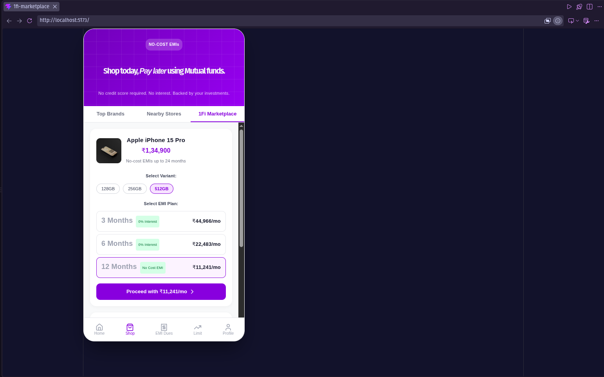

# 1Fi SDE Intern Assignment – Marketplace Feature

A mobile-responsive prototype of the **1Fi Marketplace** section within the **Shop** screen of the 1Fi web app, built to demonstrate product understanding, UI consistency, dynamic data handling, and clean component architecture.

---

##  App Preview




---

## Architectural & Tech Stack Overview

To deliver a fully functional, pixel-perfect, and robust submission within the assignment window, this prototype was built using a mobile-first web architecture.

* **Frontend Framework:** React via Vite.
* **Styling:** Custom Responsive CSS (featuring purple gradient mesh and linear grid backgrounds mirroring 1Fi branding)
* **Iconography:** Lucide-React
* **Data Layer:** Asynchronous Mock API Service (`src/data.js`) to simulate dynamic network calls, complete with loading states.


## Features Implemented

1. **Top Segmented Navigation:**
   * `Top Brands` & `Nearby Stores` tabs set as placeholders (blank views) per instructions[cite: 1].
   * `1Fi Marketplace` tab active with dynamic rendering.

2. **Marketplace Product Listing:**
   * Dynamic fetching of product catalog with simulated network latency.
   * Handles variant selections (e.g., storage sizes) seamlessly.
   * Interactive EMI Plan selection cards (calculates monthly payments and highlights interest-free options).
   * Reactive Call-to-Action (CTA) button that updates dynamically based on the selected EMI plan.

3. **User Experience & Polish:**
   * Loading state handling during initial product fetch.
   * Mobile-first responsive container centered neatly on desktop screens[cite: 1].
   * Sticky bottom navigation bar replicating core application tabs (`Home`, `Shop`, `EMI Dues`, `Limit`, `Profile`).


---


##  How to Run Locally

### Prerequisites
* **Node.js** (v16.x or higher)
* **npm**

### Installation Steps

1. **Clone the repository:**
   ```bash
   git clone [https://github.com/YOUR_USERNAME/1fi-marketplace.git](https://github.com/YOUR_USERNAME/1fi-marketplace.git)
   cd 1fi-marketplace
2. **Install dependencies:**
```bash
npm install
```
3. **Start the local development server:**
```bash
npm run dev
```
